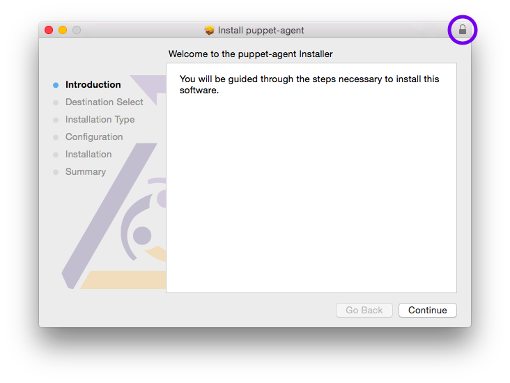
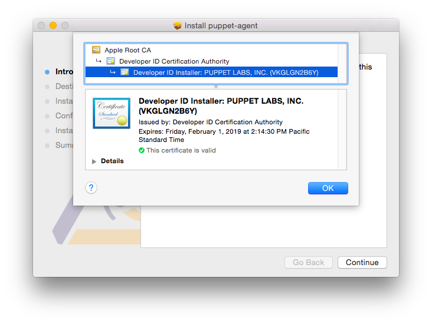



## Puppet collection contents

Puppet Collection 1 contains the following components:



## Using Puppet collections



### Yum-based systems













### Apt-based systems















### OS X systems









## Verifying Puppet packages

We sign most of our packages, Ruby gems, and release tarballs with GNU Privacy Guard (GPG). This helps prove that the packages originate from Puppet and have not been compromised.

Security-conscious users can use GPG to verify signatures on our packages.

### Automatic verification

Certain operating system and installation methods automatically verify our package signatures.

* If you install Puppet packages via our Yum and Apt repositories, the Puppet Collection release package that enables the repository also installs our release signing key. The Yum and Apt tools automatically verify the integrity of our packages as you install them.
* Our Microsoft Installer (MSI) packages for Windows are signed with a different key, and the Windows installer automatically verifies the signature before installing the package.

In these cases, you don't need to do anything to verify the package signature.

### Manual verification

If you're using Puppet source tarballs or Ruby gems, or installing RPM packages without Yum, you can manually verify the signatures.

#### Import the release signing key

Before you can verify signatures, you must import the Puppet public key and verify its fingerprint. This key is certified by several Puppet developers and should be available from the public keyservers.

To import the release signing key, run:

    gpg --recv-key 1054b7a24bd6ec30

The `gpg` tool then requests and imports the key:

    gpg: requesting key 4BD6EC30 from hkp server keys.gnupg.net
    gpg: /home/username/.gnupg/trustdb.gpg: trustdb created
    gpg: key 4BD6EC30: public key "Puppet Labs Release Key (Puppet Labs Release Key) <info@puppetlabs.com>" imported
    gpg: no ultimately trusted keys found
    gpg: Total number processed: 1
    gpg:               imported: 1  (RSA: 1)

The key is also [available via HTTP](http://pool.sks-keyservers.net:11371/pks/lookup?op=get&search=0x1054B7A24BD6EC30).

> **Note:** If this is your first time running the `gpg` tool, it might fail to import the key after creating its configuration file and keyring. This is normal, and you can run the command a second time to import the key into your newly created keyring.

#### Verify the fingerprint

The fingerprint of the Puppet release signing key is **`47B3 20EB 4C7C 375A A9DA  E1A0 1054 B7A2 4BD6 EC30`**. Run the following:

    gpg --list-key --fingerprint 1054b7a24bd6ec30

Then, ensure the fingerprint listed in the output matches the above value:

    pub   4096R/4BD6EC30 2010-07-10 [expires: 2016-07-08]
          Key fingerprint = 47B3 20EB 4C7C 375A A9DA  E1A0 1054 B7A2 4BD6 EC30
    uid                  Puppet Labs Release Key (Puppet Labs Release Key) <info@puppetlabs.com>

#### Verify a source tarball or gem

To verify a source tarball or Ruby gem, you must download both it and its corresponding `.asc` file. These files are available from <https://downloads.puppetlabs.com/puppet/>.

Next, verify the tarball or gem by running the following, replacing `<VERSION>` with the Puppet version number, and `<FILE TYPE>` with `tar.gz` for a tarball or `gem` for a Ruby gem:

    gpg --verify puppet-<VERSION>.<FILE TYPE>.asc puppet-<VERSION>.<FILE TYPE>

The output should confirm that the signature matches:

    gpg: Signature made Mon Nov 30 10:47:39 2015 PST using RSA key ID 4BD6EC30
    gpg: Good signature from "Puppet Labs Release Key (Puppet Labs Release Key) <info@puppetlabs.com>"

If you have not taken the necessary steps to build a [trust path](https://www.gnupg.org/gph/en/manual/x334.html), through the web of trust, to one of the signatures on the release key, `gpg` produces a warning similar to the following when you verify the signature:

    Could not find a valid trust path to the key.
    gpg: WARNING: This key is not certified with a trusted signature!
    gpg:          There is no indication that the signature belongs to the owner.
    Primary key fingerprint: 47B3 20EB 4C7C 375A A9DA  E1A0 1054 B7A2 4BD6 EC30

This is normal if you do not have a trust path to the key. If you've verified the fingerprint of the key as described above, GPG has verified the archive's integrity; the warning only means that GPG can't automatically prove the key's ownership.

#### Verify an RPM package

Puppet RPM packages include an embedded signature. To verify it, you must import the Puppet public key to `rpm`, then use `rpm` to check the signature.

First, retrieve the [Puppet public key](http://pool.sks-keyservers.net:11371/pks/lookup?op=get&search=0x1054B7A24BD6EC30) and place it in a file on your node.

Next, run the following, replacing `<PUBLIC KEY FILE>` with the path to the file containing the Puppet public key:

    sudo rpm --import PUBKEY <PUBLIC KEY FILE>

The `rpm` tool won't output anything if successful.

Then to verify an RPM you've downloaded, run the `rpm` tool with the `checksig` flag (`-K`):

    sudo rpm -vK <RPM FILE NAME>

This verifies the embedded signature, as signified by the `OK` results in the `rpm` output:

~~~
puppetlabs-release-pc1-fedora-22.noarch.rpm:
    Header V4 RSA/SHA1 Signature, key ID 4bd6ec30: OK
    Header SHA1 digest: OK (403bb336706e52f1eca63424a55b7f123e644b2b)
    V4 RSA/SHA1 Signature, key ID 4bd6ec30: OK
    MD5 digest: OK (97a9c407a8a7ee9f8689c79bab97250e)
~~~

If you don't import the Puppet public key, you can still verify the package's integrity using `rpm -vK`. However, you won't be able to validate the package's origin:

~~~
puppetlabs-release-pc1-fedora-22.noarch.rpm:
    Header V4 RSA/SHA1 Signature, key ID 4bd6ec30: NOKEY
    Header SHA1 digest: OK (403bb336706e52f1eca63424a55b7f123e644b2b)
    V4 RSA/SHA1 Signature, key ID 4bd6ec30: NOKEY
    MD5 digest: OK (97a9c407a8a7ee9f8689c79bab97250e)
~~~

#### Verify an OS X `puppet-agent` package

Puppet signs `puppet-agent` packages for OS X with a developer ID and certificate. To verify the signature, download and mount the `puppet-agent` disk image, then use the `pkgutil` tool with the `--check-signature` flag:

    pkgutil --check-signature /Volumes/puppet-agent-1.3.2-1.osx10.10/puppet-agent-1.3.2-1-installer.pkg

The tool confirms the signature and outputs fingerprints for each certificate in the chain:

~~~
Package "puppet-agent-1.3.2-1-installer.pkg":
   Status: signed by a certificate trusted by Mac OS X
   Certificate Chain:
    1. Developer ID Installer: PUPPET LABS, INC. (VKGLGN2B6Y)
       SHA1 fingerprint: AF 91 BF B7 7E CF 87 9F A8 0A 06 C3 03 5A B4 C7 11 34 0A 6F
       -----------------------------------------------------------------------------
    2. Developer ID Certification Authority
       SHA1 fingerprint: 3B 16 6C 3B 7D C4 B7 51 C9 FE 2A FA B9 13 56 41 E3 88 E1 86
       -----------------------------------------------------------------------------
    3. Apple Root CA
       SHA1 fingerprint: 61 1E 5B 66 2C 59 3A 08 FF 58 D1 4A E2 24 52 D1 98 DF 6C 60
~~~

You can also confirm the certificate when installing the package by clicking the lock icon in the top-right corner of the installer:



This displays details about the `puppet-agent` package's certificate:



## Nightly repositories
<!-- We should keep information about nightly repos on the /latest/ version of Puppet only. It's not relevant for older versions.-->

We provide automatically built [nightly repositories](https://nightlies.puppetlabs.com/) for *nix operating systems containing packages of **pre-release software not intended for production use**. The nightly repositories require that you also have the standard Puppet Collection repository enabled.

### Nightly?

Our automated systems create new "nightly" repositories for builds that pass our acceptance testing on the most popular platforms. This means we might not technically release builds nightly. However, they still represent bleeding-edge Puppet builds **that are not intended for production use.**

### Nightly repository contents

Each nightly repo contains a single product. We make nightly repositories for Puppet Server, Puppet Agent (including its related tools), and PuppetDB.

### Latest vs. specific commit

There are two kinds of nightly repository for each product:

-   The "-latest" repository stays around forever and always contains the latest build. We publish new packages to this repository every day or two, and are good for persistent canary systems.

-   The other repositories are all named after a specific git commit. They contain a single build, so you can reliably install the same version on many systems. These repositories are useful when testing a specific build, such to help Puppet test an impending release announced on the [puppet-users mailing list](https://groups.google.com/forum/#!forum/puppet-users).

    We delete single-commit repositories a week or two after we create them, so if you want to keep the packages available, import them into your local repository.

### Enabling nightly repositories on Yum-based systems

1.  Enable the main Puppet Collection repository, as described [above](#yum-based-systems).

2.  In a web browser, go to <https://nightlies.puppetlabs.com/>. Choose the repository you want; this will be either `<PRODUCT>-latest`, or `<PRODUCT>/<COMMIT>`.

3.  Click through to your repository's `repo_configs/rpm` directory, and identify the `.repo` file that applies to your operating system. This looks like `pl-puppet-agent-<COMMIT>-el-7-x86_64.repo`.

4.  Download the `.repo` file into the system's `/etc/yum.repos.d/` directory. For example, to install the RHEL 7 puppet-agent nightly repository for commit 732e883, run:

    ``` bash
    cd /etc/yum.repos.d
    sudo wget https://nightlies.puppetlabs.com/puppet-agent/732e883733fe5e5989afe330e3c5cea00b678d1e/repo_configs/rpm/pl-puppet-agent-732e883733fe5e5989afe330e3c5cea00b678d1e-el-7-x86_64.repo
    ```

5.  Upgrade or install the product.

### Enabling nightly repositories on Apt-based systems

1.  Enable the main Puppet Collection repository, as described [above](#apt-based-systems).

2.  In a web browser, go to <https://nightlies.puppetlabs.com/>. Choose the repository you want; this will be either `<PRODUCT>-latest`, or `<PRODUCT>/<COMMIT>`.

3.  Click through to your repository's `repo_configs/deb` directory, and identify the `.list` file that applies to your operating system. This looks like `pl-puppet-agent-<COMMIT>-xenial.list`.

4.  Download the `.list` file into the system's `/etc/apt/sources.list.d/` directory. For example, to install the Ubuntu 16.04 (Xenial) puppet-agent nightly repository for commit 732e883, run:

    ``` bash
    cd /etc/apt/sources.list.d
    sudo wget https://nightlies.puppetlabs.com/puppet-agent/732e883733fe5e5989afe330e3c5cea00b678d1e/repo_configs/deb/pl-puppet-agent-732e883733fe5e5989afe330e3c5cea00b678d1e-xenial.list
    ```

5. Run `sudo apt-get update`.

6. Upgrade or install the product.
